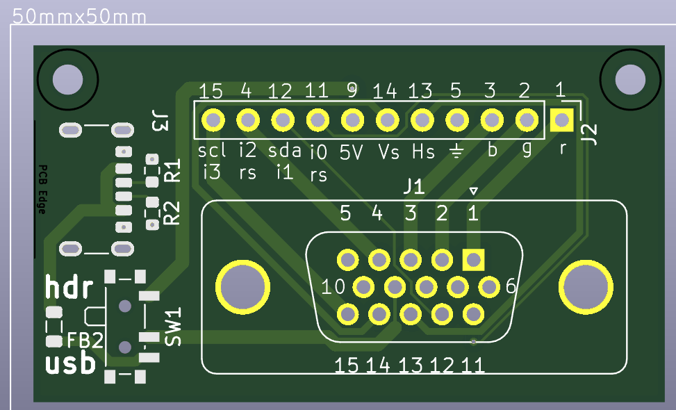
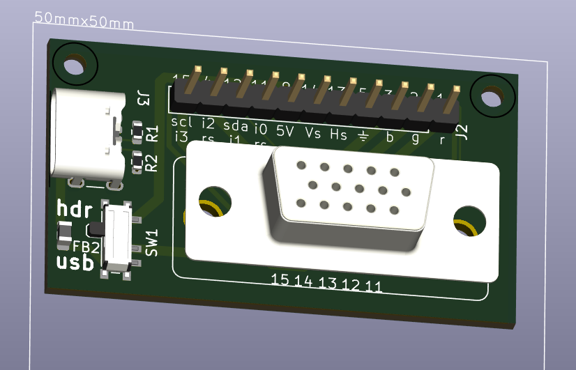
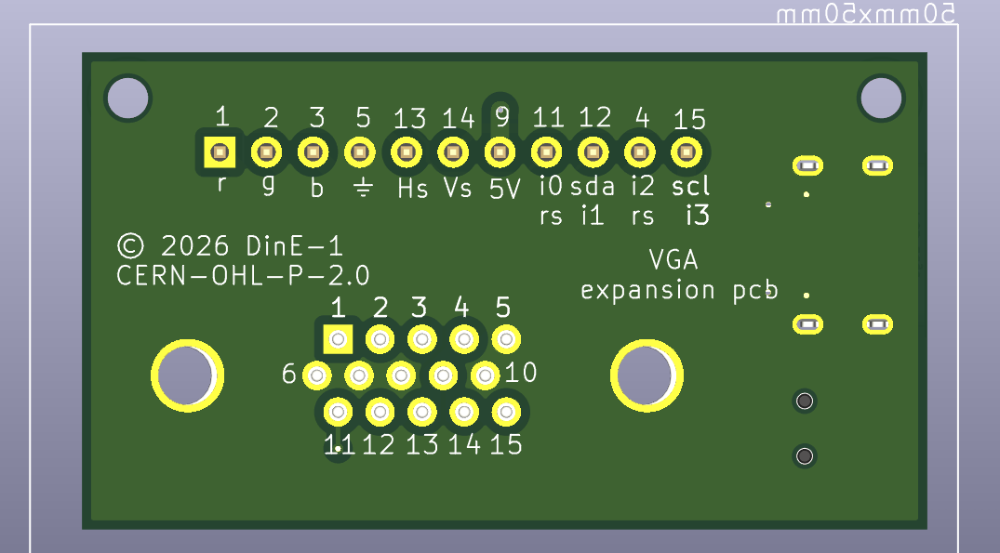

# VGA Breakout

A KiCad PCB breakout board providing easy access to VGA connector pins.

# Pictures

## Front

## Front with components

## Back

## License

Copyright (c) 2026 DinE-1

Licensed under the CERN Open Hardware Licence Version 2 - Permissive (CERN-OHL-P v2).

See the LICENSE file for details.

## Disclaimer

This design is provided as-is, without warranty of any kind.

Verify electrical compatibility and suitability for your application before manufacture or use. DinE-1 assumes no responsibility for damage, malfunction, data loss, or other consequences resulting from use of this design.
